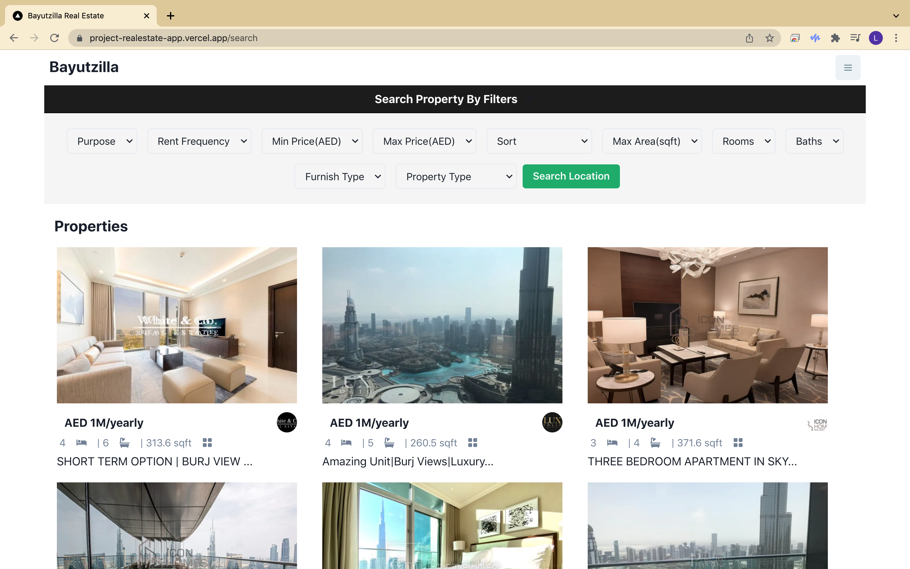

# Bayutzilla

[Bayutzilla](https://project-realestate-app.vercel.app/) is a real estate application using RapidAPI to fetch data for rental and for-sale properties. Features include advanced property filtering, property details page with an image carousel, and much more.

## Key Technologies

- Node v14.18.1
- NPM 6.14.15
- React.js
- Next.js
- ChakraUI
- RapidAPI

## Installation

1. Fork or clone this repository
2. `cd bayutzilla`
3. `npm install`
4. `npm run dev`
